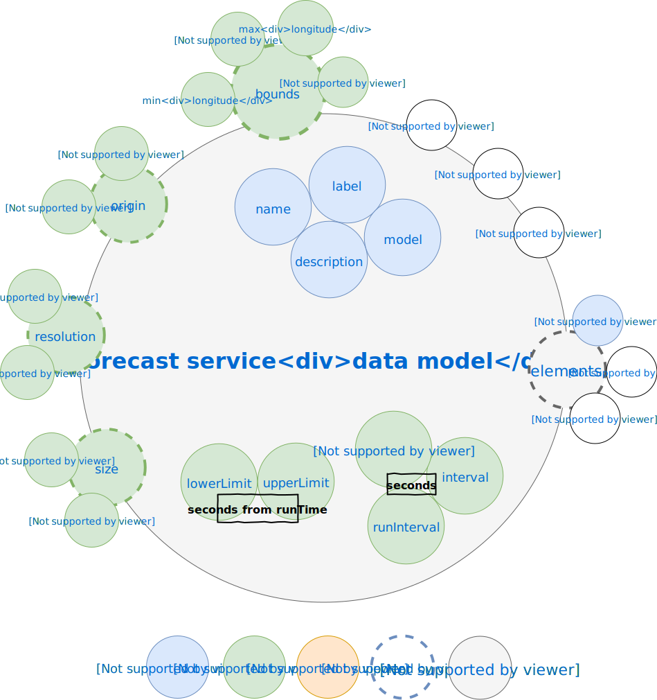
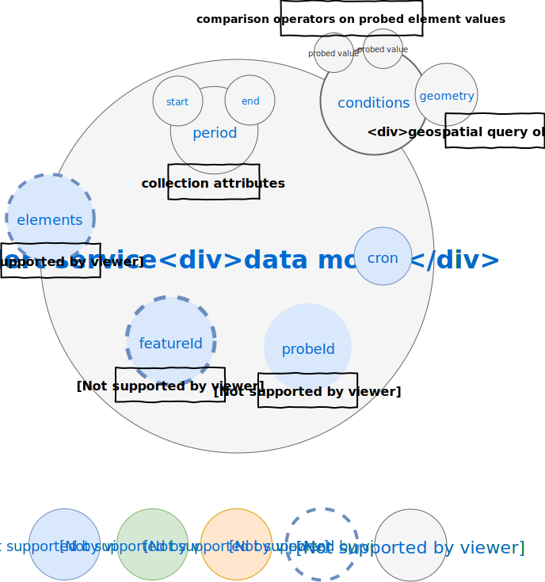

# Data model-oriented view of the architecture

According to the [Feathers philosophy](https://docs.feathersjs.com/guides/about/philosophy.html) each data model is manipulated using a [service interface](https://docs.feathersjs.com/api/services.html) to perform [CRUD operations](https://en.wikipedia.org/wiki/Create,_read,_update_and_delete) of the [persistence layer](https://docs.feathersjs.com/api/databases/common.html). So this data model-oriented view is a service-oriented view in the same manner.

Because data models internally rely on [JSON](http://www.json.org/) they are by nature hierarchical. In the following diagrams each nested JSON object is represented as a smaller *bubble* in a bigger *bubble* (the nesting/parent object), the data model instance being the root JSON object or the *biggest* bubble. The name of the bubble is the name of the nesting object property owing the nested object.

## Forecast data model

The common properties of a forecast model instance are described by the following data model:

This data model is instantiated from the [configuration](./../guides/basics.md#configuring) and manipulated through the [Forecast model API](./../api/forecast.md).

The details of each property are the following:
* **name** : internal model name that will be used in path to reach the underlying service
* **label** : the label for the model in the user interface
* **description** : the description for the model in the user interface
* **attribution** : the attribution of the data to be displayed when visualized
* **model** : the model plugin to be used for this forecast
* **bounds** : the geographical bounds covered by the model as an array of decimal values `[min longitude, min latitude, max longitude, max latitude]`
* **origin** : the geographical origin of the data grid as an array of decimal values `[longitude origin, latitude origin]`
* **size** : the size of the data grid as an array of integer values `[width, height]`
* **resolution** : the geographical resolution of the data grid as an array of decimal values `[longitude resolution, latitude resolution]`
* **tileResolution** : the geographical resolution of the data tiles as an array of decimal values `[longitude resolution, latitude resolution]`, if not given will not produce tiles
* **timeseries** : if true will also generate tiles with aggregated data over all forecast times
* **runInterval** : the period between two forecast runs (in seconds) - it also defines at which hours of the day the forecast data are produced (e.g. `00:00 - 06:00 - 12:00 - 18:00` for a `3600` seconds period)
* **oldestRunInterval** : how long do the server go back in time when harvesting forecast data (in seconds)
* **interval** : the period between two forecast time steps (in seconds)
* **lowerLimit** : the offset from run time for the first forecast time step to be gathered (in seconds)
* **upperLimit** : the offset from run time for the last forecast time step to be gathered (in seconds)
* **updateInterval** : the check period for data updates (default is every 15 minutes)
  * if `< 0` no update will be performed, you need to trigger it manually by calling `updateForecastData()` on the associated element service
  * if `= 0` a single update will be performed when launching the server
  * if `> 0` an update every N seconds will be performed as long as the server runs
* **elements** : an array of forecast elements that will be managed for this model, the common properties are the following
  * **name** : internal element name that will be used in path to reach the underlying service
  * **bucket** : download bucket ID
  * **dataStore** : data store to be used for the forecast data, could be
    * `db` to store it directly in database (default if not given)
    * `fs` to store it on the file system
    * `gridfs` to store it using [GrigFS](https://docs.mongodb.com/manual/core/gridfs/)
  * **interval**, **lowerLimit**, **upperLimit** to override on a per-element basis the default forecast options (see description before)

> By default all elements of a forecast model are downloaded sequentially unless you specify some buckets. If so, buckets are downloaded sequentially but all elements belonging to the same bucket will be downloaded in parallel.

## Element data model

The common properties of a forecast element are described by the following data model:

This data model is instantiated when forecast data are gathered by [Forecast model plugins](./../api/plugin.md) and manipulated through the [Forecast element API](./../api/element.md).

The details of each property are the following:
* **runTime**: the date/time of the model run that produced the forecast data
* **forecastTime** : the date/time of the forecast data
* **minValue** : the minimum value of the element in the forecast data
* **maxValue** : the maximum value of the element in the forecast data
* **data** : the forecast data for the element

A forecast element will cover the period until the start of the next available forecast, what is called the Time To Live (or TTL in short), this is typically one or three hour(s) for much of forecast data. Once its validity has expired it is automatically removed from the database.

If the data store of the element in the forecast model configuration is the database then the **data** property containing forecast data is stored in the model, otherwise if the data store is the file system it has an additional **convertedFilePath** (respectively **filePath**) property only used internally to retrieve the JSON converted (respectively source) data on-the-fly.

> When tiling is configured each forecast element generate an additional tile set with the following additional properties:
* **x/y** : coordinate of the tile in the tile set grid
* **bounds** : the geographical bounds covered by the tile as an array of decimal values `[min longitude, min latitude, max longitude, max latitude]`
* **origin** : the geographical origin of the tile data grid as an array of decimal values `[longitude origin, latitude origin]`
* **size** : the size of the tile data grid as an array of integer values `[width, height]`
* **resolution** : the geographical resolution of the tile data grid as an array of decimal values `[longitude resolution, latitude resolution]`
* **geometry**: GeoJSON geometry of the tile

## Probe data model

The properties of a probe object are described by the following data model:

This data model is instantiated when forecast data are asked to be probed by the [Probe plugin](./../api/probe.md) and manipulated through the [Probes API](./../api/probe.md#probes-api).

The common model for on-demand or stream mode is a [GeoJSON feature collection](https://tools.ietf.org/html/rfc7946#section-3.3), where each [GeoJSON feature](https://tools.ietf.org/html/rfc7946#section-3.2) describes a location of interest.

::: warning
For now only features with [GeoJSON point geometry](https://tools.ietf.org/html/rfc7946#section-3.1.2) are supported.
:::

The following additional properties of the GeoJSON collection allows to configure the probe:
* **forecast**: the forecast model instance name to be probed according to the [configuration](../guides/basics.md#configuring),
* **elements**: array of names corresponding to the forecast element values to be probed in the forecast data (each element has to be declared in the the [configuration](./../guides/basics.md#configuring))
* **featureId**: only useful for streamed probes, indicates which field(s) can be used as unique identifier of your features (support dot notation)

::: warning
Features of the collection are usually numerous so they are not returned by default, you have to explicitly ask for using [`$select`](https://docs.feathersjs.com/api/databases/querying.html#select).
:::

## Probe result data model

The properties of a probe result object are described by the following data model:

This data model is instantiated when forecast data are probed by the [Probe plugin](./../api/probe.md) and manipulated through the [Probe results API](./../api/probe.md#probe-results-api).

The common model for probe results is a [GeoJSON feature](https://tools.ietf.org/html/rfc7946#section-3.2) with [GeoJSON point geometry](https://tools.ietf.org/html/rfc7946#section-3.1.2). Each result contains an additional property per probed element (in the `properties` field), according to its [configured name](./../guides/basics.md#configuring), storing the target element value. It also contains the following:
* **runTime**: the date/time of the model run that produced the forecast data that has been used to produce the probe result
* **forecastTime** : the date/time of the forecast data that has been used to produce the probe result

:::tip
When performing probe results aggregation probed value, runTime and forecastTime will be arrays ordered according to ascending time and stored in an additional property per probed element according to its [configured name](./../guides/basics.md#configuring)
::: 

## Alert data model

The properties of an alert object are described by the following data model:

This data model is instantiated and manipulated through the [Alert API](./../api/alert.md).

The details of each property are the following:
* **cron**: a [CRON pattern](https://github.com/kelektiv/node-cron) to schedule the alert check at regular intervals, e.g. `* 0 * * * *` will run it every minute
* **probeId**: the ID of the probe to be checked by the alert
* **elements**: array of names corresponding to the probed forecast element values to be checked by the alert (each element has to be declared in the the [configuration](../guides/basics.md#configuring))
* **featureId**: indicates which field(s) can be used as a unique identifier of your probe features (support dot notation)
* **period**: time interval used to do the matching between the forecast data and the trigger conditions
  * **start**: offset which needs to be added to the current timestamp at the moment of validation to compute the beginning of the time interval used to check the conditions, specified as [moment.js duration object](https://momentjs.com/docs/#/manipulating/add/)
  * **end**: offset which needs to be added to the current timestamp at the moment of validation to compute the end of the time interval used to check the conditions, specified as [moment.js duration object](https://momentjs.com/docs/#/manipulating/add/)
* **conditions**: query specification which contains nested objects:
  * **[element]**: for each checked element a filter according to the computed element values specified using the [Feathers common database query API](https://docs.feathersjs.com/api/databases/querying.html)
  * **geometry** specification of a [geospatial query](https://docs.mongodb.com/manual/reference/operator/query/geoWithin/)
